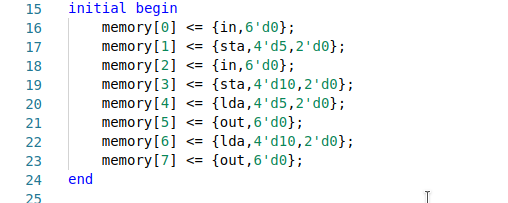
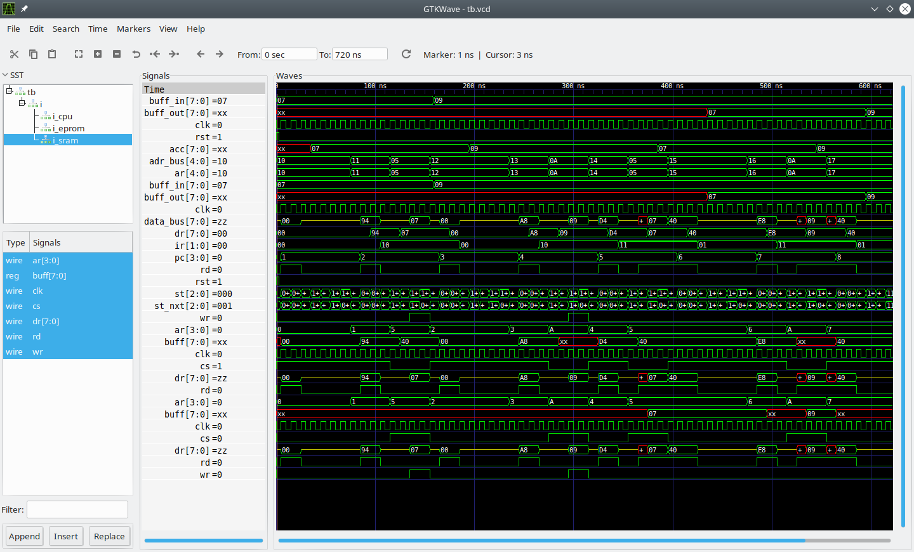

# **Masina load-store**
### **Cuprins:**
1. [Scop](#1-scop)
2. [Setul de instructiuni](#2-setul-de-instructiuni)
3. [Arhitectura](#3-arhitectura)
4. [Simulare](#4-simulare)
5. [Note](#5-note)
## **1. Scop**
Modelarea unui sistem de calcul primitiv capabil de executia unor instructiuni care vizeaza operatii cu memoria si perifericele si simularea modelulului in vederea demonstrarii functionalitatii lui.


## **2. Setul de instructiuni**
Instructiunile care pot fi executate de o astfle de masina de calcul sunt codificate folosind opt biti, ele impartindu-se in doua clase:
* de memorie: ***load*** si ***store***
* cu perifericele: ***input*** si ***output***.

*Despre formatul lor*: sunt instructiuni pe opt biti, dintre care cei mai semnificativi doi biti reprezinta codul operatiei, restul bitilor fiind dedicati operandului in cazul in care acesta exista.\
Codurile pentru fiecare instructiune sunt:
- *input*:	00
- *output*:	01
- *store*:	10
- *load*:	11.

Instructiunile pentru lucrul cu perifericele nu prezinta niciun operand (se poate vedea in figura de mai jos):
- *input*: preia datele de la intrare si le depoziteaza in registrul acumulator
- *output*: aifseaza la iesire datele din registrul acumulator.

| rolul bitului        | opcode | opcode | don't care | don't care | don't care | don't care | don't care | don't care |
| ----------------     | ------ | ------ | ---------- | ---------- | ---------- | ---------- | ---------- | ---------- |
| **ordinul bitului**  | 7      | 6      | 5          | 4          | 3          | 2          | 1          | 0          |

Intrarea si iesirea sunt reprezentate de niste registre tampon care au dimensiunea de un octet fiecare (buff_in pentru intrare si buff_out pentru iesire).
Instructiunile pentru lucrul cu memoria contin in formatul lor pe langa un cod pentru operatie si patru biti dedicati unui operand (se poate vedea in figura de mai jos):
* *store x*: scrie in memorie la adresa x continutulregistrului acumulator
* *load x*: incarca in acumulator valoarea de la adresa de memorie x.
  
| rolul bitului        | opcode | opcode | operand    | operand    | operand    | operand    | don't care | don't care |
| ----------------     | ------ | ------ | ---------- | ---------- | ---------- | ---------- | ---------- | ---------- |
| **ordinul bitului**  | 7      | 6      | 5          | 4          | 3          | 2          | 1          | 0          |
## **3. Arhitectura**
Sistemul este alcatuit din trei componente:
- [un microprocesor](#microprocesorul),
- [o memorie EPROM](#memoria-pentru-porgam) care contine instructiunile care vor fi executate,
-  [o memorie SRAM](#memoria-pentru-date) folosita pentru scrierea si citirea datelor in timpul executiei unui program,

toate aceste elemente fiind interconectate prin intermediul magistralelor de date (*data_bus*) si de adrese (*address_bus*).
### **Microprocesorul**
Microprocesorul prezinta o [unitate de control](#unitatea-de-control), [cateva registre](#registrele-sunt) si [semnale pentru resetare, citire si scriere](#semnalele-de-care-dispune-circuitul-sunt).
#### **Unitatea de control**:
- este modelata ca un automat sincron cu stari finite de tip Moore, aceasta are opt stari, fiecare stare reprezentand in fapt un stagiu de executie al unei instructiuni. Un stagiu este executat in cadrul unei perioade de tact, cu alte cuvinte, stagiile se modifica la fiecare ciclu de tact. Detalieri cu privire la stagiile de executie pentru o instructiune sunt oferite in diagrama de mai jos (in tabel).

|  S1       |  S2    |  S3        |  S4       |  S5              |  S6            |  S7           |  S8      |
| ----      | ----   | ----       | ----      | ----             | ----           | ----          | ----     |
|AR[3:0]<=PC|PC<=PC+1|DR<=data_bus|RD<=0      |if(IR==00)        |if(IR==10)      |if(IR==10)     |if(IR==11)|
|AR[4]<=1   |RD<=1   |            |IR<=DR[7:6]| ACC<=BUFF_IN     | DR<=ACC        | WR<=1         | ACC<=DR  |
|WR<=0      |        |            |           |else if(IR==01)   |else if(IR==11) |else if(IR==11)|          |
|           |        |            |      	  | BUFF_OUT<=ACC    | RD<=1          | DR<=data_bus  |          |
|           |        |            |           |else              |                |               |          |
|           |        |            |           | AR[4]<=0         |                |               |          |
|           |        |            |           | AR[3:0]<=DR[5:2] |                |               |          |

#### **Registrele sunt:**
- **PC** (program counter, pe 4 biti): numaratorul de program, indica adresa din memorie (cea care contine codul de executat) de la care va trebui sa fie executata urmatoarea instructiune; intrucat setul de instructiuni implementat de aceasta masina nu contine si instructiuni pentru sarituri in program, acesta se va autoincrementa la fiecare ciclu masina, fara a suferi alte operatii. La activarea semnalului de resetare acesta ia valoarea zero;
- **AR** (address register, pe 5 biti): registrul de adrese, contine valoare pe care o va situa pe magistrala de adrese, fiind in permanenta conectat la aceasta. Din cei cinci biti, patru sunt folositi pentru adresarea memoriilor (folosind in cadrul acestui microsistem memorii cu adresarea pe patru biti) si un bit pentru decodificarea cipului de memorie, cel mai semnificativ bit al registrului folosindu-se in acest sens, astfel, daca este activ acest bit de selectie, masina va opera cu memoria de program, altfel, va opera cu memoria de date;
- **DR** (data register, pe 8 biti): registrul de date, contine datele pe care le-a citit sau pe care le va scrie in memorie sistemul de calcul; dimensiunea acestuia este de exact un octet, cat are si un cuvant de memorie;
- **IR** (instruction register, pe 2 biti): registrul de instructiuni, contine codul operatiei care se executa in momentul curent;
- **ACC** (accumulator, pe 8 biti): registrul folosit ca tampon pentru operatiile de care dispune masina.
#### **Semnalele de care dispune circuitul sunt:**
- ***read***: semnal pentru citire, anunta circuitul cu care comunica faptul ca urmeaza sa preia datele de la acesta;
- ***write***: semnal pentru scriere, anunta circuitul cu care comunica faptul ca urmeaza sa ii ofere date;
- ***reset***: semnal de reset asincron, reseteaza toate registrele, iar automatul sincron este adus in starea initiala;
- ***clock***: semnalul de tact al masinii de calcul.
### **Memoria pentru porgam**
Memoria pentru program este un cip ***EPROM*** avand *dimensiunea de 16 biti* (2 octeti), cu *dimensiunea cuvantului de un octet*. Prezinta semnale pentru **citire** (read), **selectia cipului** (chip select), respectiv un **semnal de tact**, fiind memorie sincrona. Cand semnalul de *chip select* este inactiv circuitul nu opereaza, magistralele de date fiind situate in *impedenta ridicata* si nicio operatie nu va avea loc, daca este activ, depinde de starea semnalului de *read*, astfel, daca **read** este activ, circuitul va situa pe magistrala de date valoarea de la adresa specificata prin magistrala de adrese. Scrierea acestui cip este implementata la initializarea modulului verilog, in practica, facandu-se dupa stergearea inforatiei din aceasta, sub actiunea radiatiilor UV.
### **Memoria pentru date**
Memoria pentru date este un cip **SRAM** avand *dimensiunea de 16 biti* (2 octeti), cu *dimensiunea cuvantului de un octet*. Prezinta semnale pentru **citire** (read), **scriere** (write), **selectia cipului** (chip select), respectiv un **semnal de tact**, fiind memorie sincrona. Cand semnalul de *chip select* este inactiv circuitul nu opereaza, magistralele de date fiind situate in *impedenta ridicata* si nicio operatie nu va avea loc, daca este activ, depinde de starea semnalelor de *read* si de *write*, astfel, daca **read** este activ si **write** este inactiv, circuitul va situa pe magistrala de date valoarea de la adresa specificata prin magistrala de adrese, daca **read** este inactiv si **write** activ, circuitul va situa magistrala de date in *impedanta ridicata* fiind pregatit sa primeasca informatii din exterior, urmand sa scrie la adresa de memorie indicata pe magsitrala de adrese valoarea primita.

## **4. Simulare**
Proiectul contine trei fisiere sursa scrise in limbajul de sinteza si simulare hardware verilog. Fisierele au nume sugestive, astfel ca *``cpu.v``* contine codul sursa pentru generarea microprocesorului, *``erpom.v``* contine codul sursa pentru generarea memoriei de program, *EPROM*, iar *``sram.v``* contine codul sursa pentru generarea memoriei de date, *SRAM*. De asemenea, acesta pune la dispozitie un fisier testbench care demonstreaza functinoarea sistemului pentru rularea uni cod scris in memoria *EPROM*, codul pentru modulul de test fiind tot in fisierul *``cpu.v``*. Codul reprezinta un program de opt instructiuni:
```
INPUT
STORE 5
INPUT
STORE 10
LOAD 5
OUTPUT
LOAD 10
OUTPUT
```
.

Instructiunile in cod masina aferente programului anterior pot fi accesate la o urmarie atenta a fisierului corespunzator sintezei si simularii circuitului *EPROM* (*``erpom.v``*).\
||
|:--:|
|<i>Cod masina</i>|

## **5. Note**
Pentru simularea sistemului digital este nevoie de o unealta care poate sa compileze si genereze diagramele din cod de verilog. Pentru realizarea proiectului a fost folosit simulatorul [icarus-verilog](http://iverilog.icarus.com/). Pentru generarea undelor a fost folosit programul [GTKWave](http://gtkwave.sourceforge.net/). Ca sa fie mai usor de obinut un fisier care sa contina diagramele de faza este pus la dispozitie un script, ``run``, care contine comenzile necesare pentru ca icarus-verilog sa  genereze formele de unda, fiind de ajuns o simpla rulare a acestuia. Dupa executia scriptului vor fi generate fisiere care pot fi nedorite, extensiile acestora fiind notate in fisierul ``.gitignore``. Este posibil ca scriptul sa nu fie executabil in alte sisteme de operare in afara de *cele bazate pe Unix*, astfel ca, pentru *o versiune de Windows*, de exemplu, recomandarea ar fi sa se adauge extensia specifica executabilelor (``.exe``).
|  |
|:--:|
|<i>Frome de unda</i>|
